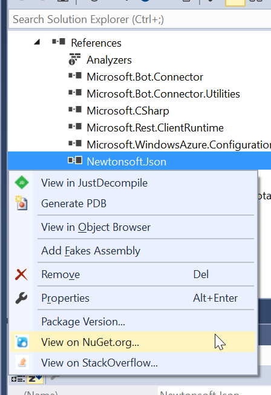
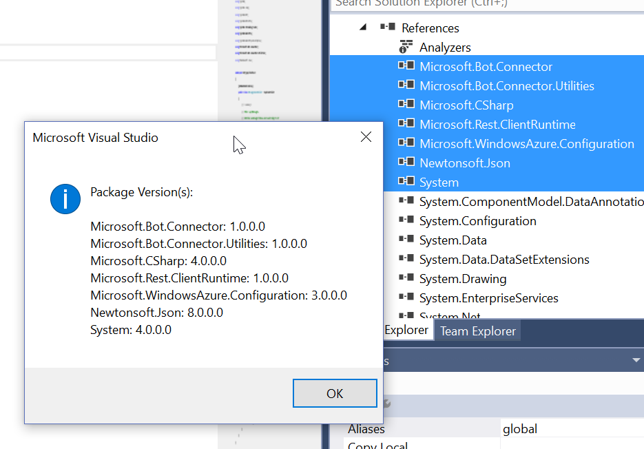

# Project Reference Context Menu Extension

Download this extension from the [VS Gallery](https://visualstudiogallery.msdn.microsoft.com/b2a3b8ac-2542-4415-91ed-daf4b0c9285b)
or get the [CI build](http://vsixgallery.com/extension/f8b219f9-f168-481a-b73b-b85d79eceb7b/).

---------------------------------------

Adds context menu items to project reference to quickly open NuGet, Stack Overflow, etc for one or more references.

See the [changelog](CHANGELOG.md) for changes and roadmap.

## Features

- Additional context menu items to allow easy access to enhanced functionality.

### 1. Version Information
Get the version information for one (or more) selected project references

### 2. Open NuGet home page
Open the NuGet.org home page for any selected NuGet references

### 3. Search StackOverflow
Open a StackOverflow search based on the NuGet id of selected references

## Contribute
Check out the [contribution guidelines](CONTRIBUTING.md)
if you want to contribute to this project.

For cloning and building this project yourself, make sure
to install the
[Extensibility Tools 2015](https://visualstudiogallery.msdn.microsoft.com/ab39a092-1343-46e2-b0f1-6a3f91155aa6)
extension for Visual Studio which enables some features
used by this project.

## License
[Apache 2.0](LICENSE)